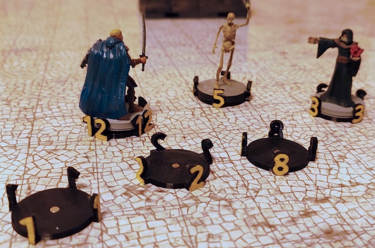

<h1 align="center">MiniTag</h1>

Number tags for standard 28/32 mm tabletop miniature models

  <a href="#about">About</a> •
  <a href="#download">Download</a> •
  <a href="#faqs">FAQs</a> •
  <a href="#license">License</a>

## About

Inspired by creature number tokens and marker rings I wanted to have more convenient number tokens for my D&D creatures. Since most of my monster and enemy minis already have [magnetic bases](https://github.com/manolitto/minibase), I ended up with these generic number slots which securely hold my minis during game play by means of tiny magnets.

#### Key features:

- easy to apply and remove during game play
- number visible from all sides
- compatible with my [Magnetic Mini Bases](https://github.com/manolitto/minibase)

## Download

You can find the latest release [here](https://github.com/manolitto/minitag/releases/latest).

## FAQs

**Question:** What size of magnets are the cylinder cut outs meant for?

**Answer:** I use axially magnetized 3mm x 2mm N42 neodymium magnets like [these here](https://smile.amazon.de/dp/B003BKPIN0).

---

## License

 MiniTag is licensed under a <a rel="license" href="http://creativecommons.org/licenses/by-sa/4.0/">Creative Commons Attribution-ShareAlike 4.0 International License</a>.
